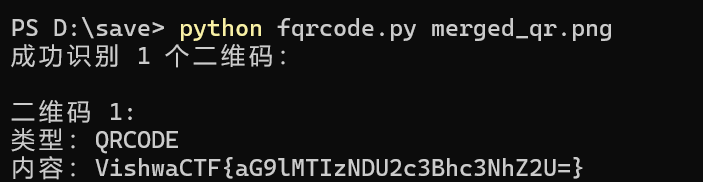

# QR Code Decoder

[](https://www.python.org/)
[](https://pypi.org/)

解决传统二维码扫描工具（如PsQREdit）无法识别的复杂二维码而设计的增强型解码工具。

在一次CTF比赛中得到的二维码使用PsQREdit无法识别，于是有了这个脚本

## 📌 核心优势

✅ **精准解码传统工具无法识别的二维码**  
✅ 支持低对比度/模糊图像  
✅ 自动修复模块对齐问题  
✅ 多编码格式兼容（UTF-8/GBK/二进制）  
✅ 批量处理能力（实验性支持）

## 🛠 安装指南

### 前置要求

- Python 3.7+
- Windows/macOS/Linux

### 快速安装

```bash
# 安装依赖库
pip install pillow pyzbar
```

### 用法

``` cmd
python fqrcode.py merged_qr.png
```

### 示例


